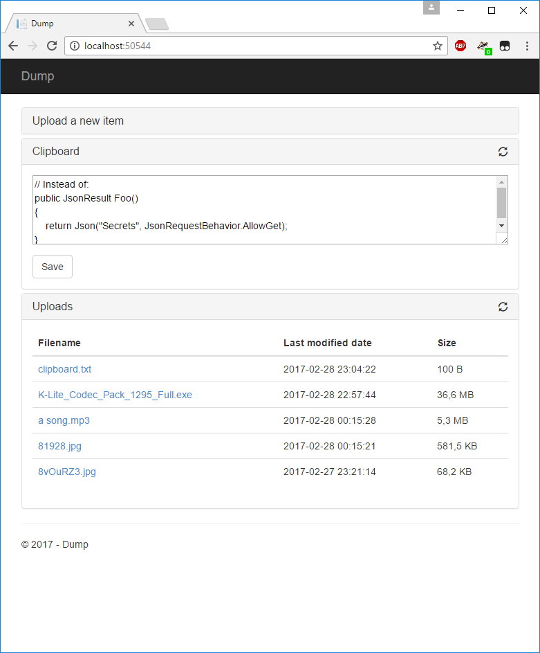

# dump.net
Very simple private filelocker &amp; notes

Dump.net is a very simple files & notes sharing tool. It is intended to be used by small teams in a private environment. It allows uploads up to 4 GB.
It has no security measures whatsoever, **use at your own risk**.

Host it with IIS and change the value of uploadsDir in Web.config. I recommend [assigning a mount point folder path to a drive](https://technet.microsoft.com/nl-nl/library/cc753321(v=ws.11).aspx) to deny path traversal. Also make sure you setup some kind of authentication.

Some tips:
* [Simple auth](https://github.com/nabehiro/HttpAuthModule)
* [Redirect to https](https://stackoverflow.com/a/9823208)

*TODO*
- Remove unused libraries
